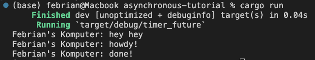

## 1.2. Understanding how it works

Terlihat dari output bahwa "hey hey" diprint terlebih dahulu daripada "howdy!" dan "done". Hal tersebut terjadi karena "hey hey" tidak termasuk pada fungsi asynchronous sehingga akan dieksekusi langsung, sedangkan "howdy!" dan "done" masuk kedalam fungsi tersebut. Fungsi tersebut di spawn dengan spawner.spawan() dan drop spawner menunjukkan bahwa tidak adalagi yang akan di spawn. executor.run() akan memproses pekerjaan yang telah dispawn secara asynchronous dan tidak akan melakukan block pada proses lain seperti "hey hey".

