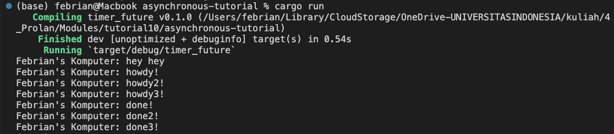

## 1.2. Understanding how it works

Terlihat dari output bahwa "hey hey" diprint terlebih dahulu daripada "howdy!" dan "done". Hal tersebut terjadi karena "hey hey" tidak termasuk pada fungsi asynchronous sehingga akan dieksekusi langsung, sedangkan "howdy!" dan "done" masuk kedalam fungsi tersebut. Fungsi tersebut di spawn dengan spawner.spawan() dan drop spawner menunjukkan bahwa tidak adalagi yang akan di spawn. executor.run() akan memproses pekerjaan yang telah dispawn secara asynchronous dan tidak akan melakukan block pada proses lain seperti "hey hey".

## 1.3. Multiple spawn and removing drop

Terlihat bahwa ketika dijalankan (sebelum removing drop) maka akan terlihat proses asinkronus dimana setiap semua antrean yang telah dispawn akan dijalankan dan tidak akan ngeblock proses setelahnya sehingga ketika menunggu 2 detik proses yang telah dispawn setelahnya bisa diprint terlebih dahulu.

Terlihat bahwa setelah removing drop bahwa program tidak pernah berhenti karena tanpa drop maka spawner akan terus menunggu task untuk dimasukkan kedalam antrean.